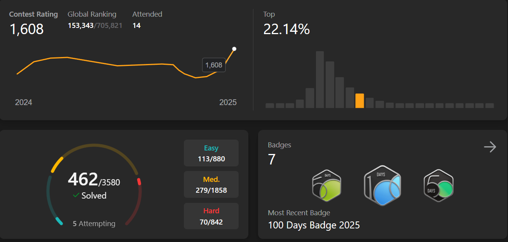

<h1 align="center">Hi there! 👋 I'm TAREQ AZIZ</h1>

## 🌟 About Me  

 

  
  
  
  

 

## 🌟 HTML + CSS + JavaScript projects
- [Web app to desktop app in minutes](https://cerulean-kashata-50763c.netlify.app/)

## 🌟 HTML + CSS projects
- [E-Commerce](https://brandhuman.netlify.app/)

## 🌟React Frontend Projects :
- [E-Commerce-Advance](https://reliable-vacherin-78a9d8.netlify.app/)

## 🌟React Zustand Projects
- [Recipe Book](https://recipe-app-liard-phi.vercel.app/)
- [Meals Project](https://meals-project-ten.vercel.app/)
- [Expense Tracker](https://expense-tracker-iota-three-89.vercel.app/)

## 🌟Games projects
- [Simon Games](https://gamessimon.netlify.app/)

## 🌟LLD Simple Project
https://github.com/tareq159615/LLD

## 🌟Certificate 

