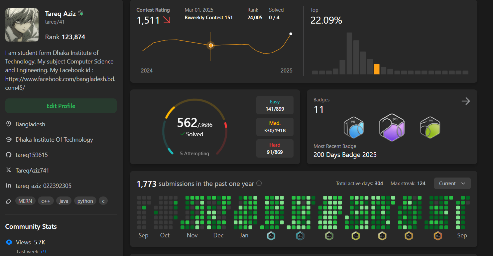

<h1 align="center">Hi there! 👋 I'm TAREQ AZIZ</h1>

## 🌟 About Me  
<h4>Hello! I'm Tareq, a developer based in Dhaka, Bangladesh. My journey into web development began with a strong curiosity for how things work, which led me to pursue a Diploma in Computer Science & Engineering. I thrive on building applications that are not only functional but also provide a seamless user experience.

My expertise lies in the frontend, particularly with the React ecosystem, but I'm also comfortable working on the backend with Node.js and Express. I'm a firm believer in clean code, SOLID principles, and the power of design patterns to create maintainable and scalable software.

Beyond coding, I'm an avid problem solver, constantly sharpening my skills on platforms like LeetCode and GeeksforGeeks. This passion for logical challenges directly translates into my development work, helping me to approach problems with a structured and analytical mindset.</h4>

## 🌟 SHOW MY PORTFOLIO 

 

## 🌟 Contact Me

  
  
  
  

 

## 🌟 MERN Full Stack Project
- [Web app to desktop app in minutes🔗](https://mern-project-1-d7sj.onrender.com/) ➡️ [See repository🔗](https://github.com/tareq159615/My-Project_1)

## 🌟 HTML + CSS + JavaScript projects
- [Web app to desktop app in minutes🔗](https://cerulean-kashata-50763c.netlify.app/) ➡️ [See repository🔗](https://github.com/tareq159615/mern-project-1)

## 🌟 HTML + CSS projects
- [E-Commerce🔗](https://brandhuman.netlify.app/) ➡️ [See repository🔗](https://github.com/tareq159615/MY-first-web)

## 🌟React Frontend Projects :
- [E-Commerce-Advance🔗](https://reliable-vacherin-78a9d8.netlify.app/) ➡️ [See repository🔗](https://github.com/tareq159615/E-Commerce-Advance-Filteringsrc)

## 🌟React Zustand Projects
- [Advance Task List App](https://advance-task-list-app.vercel.app/) ➡️ [See repository🔗](https://github.com/tareq159615/Advance-Task-List-App)
- [Advance todo list](https://react-zustand-todo-list-orcin.vercel.app/) ➡️ [See repository🔗](https://github.com/tareq159615/React-zustand-Todo-List)
- [Recipe Book🔗](https://recipe-app-liard-phi.vercel.app/) ➡️ [See repository🔗](https://github.com/tareq159615/Recipe-App)
- [Meals Project🔗](https://meals-project-ten.vercel.app/) ➡️ [See repository🔗](https://github.com/tareq159615/Meals-Project)
- [Expense Tracker🔗](https://expense-tracker-iota-three-89.vercel.app/) ➡️ [See repository🔗](https://github.com/tareq159615/Expense-Tracker)
- [Form builder🔗](https://form-builder-5yla.vercel.app/) ➡️ [See repository🔗](https://github.com/tareq159615/Form-Builder-)

## 🌟Games projects
- [Simon Games🔗](https://gamessimon.netlify.app/) ➡️ [See repository🔗](https://github.com/tareq159615/simon_game)

## 🌟LLD Simple Project
https://github.com/tareq159615/LLD 

## 🌟Certificate 

