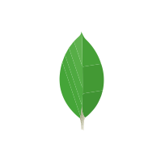

<h1 align="center">Hi there! 👋 I'm TAREQ AZIZ</h1>

## 🌟 About Me  
I'm a passionate **Softower Developer** . I love building efficient and scalable solutions that solve real-world problems.

;; - 🖥️ Building secure, scalable, and modern systems.
;; - 🌐 Working with **Next.js**, **React JS**, **Node JS**, **.NET** and more.
;; - 🔒 Passionate about **Low level design**, **Softower Developer**.
;; - 🚀 ​Efficient **OOPs Concepts (Object-Oriented Programming)**, **Advanced OOPs**

 

  ;; 
  
  
  
  

 

---

## 🛠️ Tech Stack  

  
  
  
  
  
  
  
  
  
  
  
  
  

### Favourite Tools

---

## 🌟LLD Simple Project
https://github.com/tareq159615/LLD

## 🌟Certificate 

